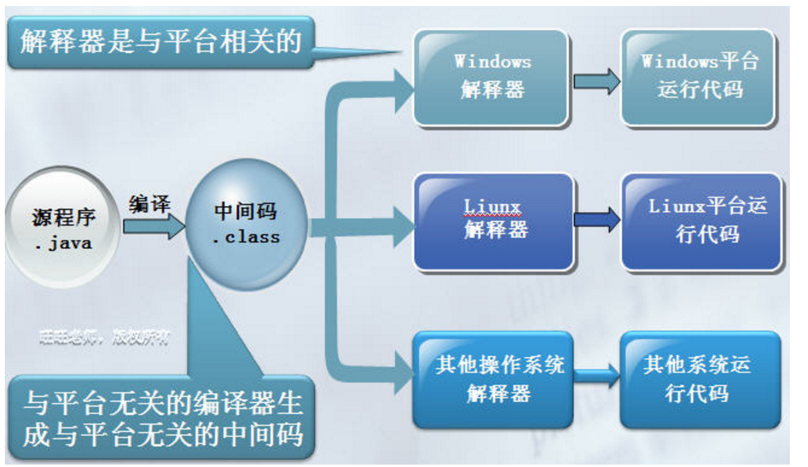
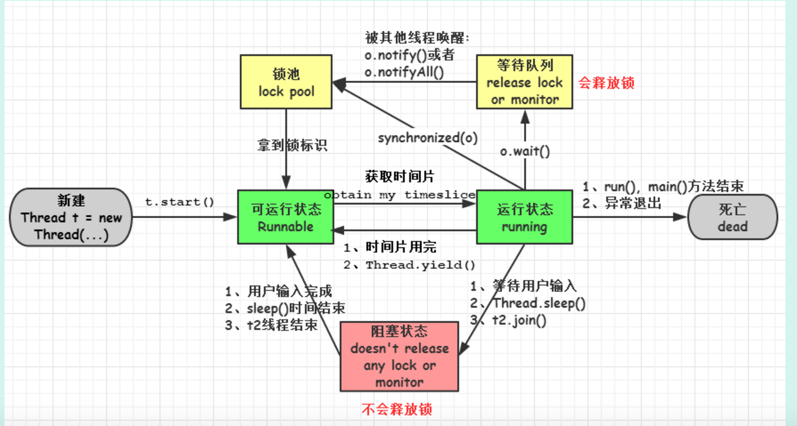

### 1 什么是Java虚拟机？为什么Java被称作是“平台无关的编程语言”？
虚拟机是一种抽象化的计算机，通过在实际的计算机上仿真模拟各种计算机功能来实现的。Java虚拟机有自己完善的硬体架构，如 处理器 、 堆栈 、 寄存器 等，还具有相应的 指令系统。JVM屏蔽了与具体操作系统平台相关的信息，使得Java程序只需生成在Java虚拟机上运行的目标代码（ 字节码 .class文件 ），就可以在多种平台上不加修改地运行。

[参考](http://www.cnblogs.com/gw811/archive/2012/09/09/2677386.html)

  
  
### 2 JDK和JRE的区别是什么？
JDK具有整套的java开发包，包含了JRE，编译器等工具，JRE是java的运行环境，包含JVM和需要执行的程序

### 3 ”static”关键字是什么意思？Java中是否可以覆盖(override)一个private或者是static的方法？ 

Static表示静态的意思，可用于修饰成员变量和成员函数。
静态是随着类的加载而加载的，静态的变量或者函数可以通过类名直接调用，不依赖任何对象。
被静态修饰的成员函数只能访问静态成员，不可以访问非静态成员。

覆盖是子类中的方法和子类继承的父类中的方法一样（函数名，参数，参数类型，反回值类型），但是子类中的访问权限要不低于父类中的访问权限。因为子类的方法可以被父类调用，如果方法由父类的public变成private,则父类访问不到.

无法重写被private修饰的方法，因为被private修饰的父类方法在子类中是不可见的。

static修饰的方法是静态绑定的，而方法覆盖是为了实现多态，是动态绑定，所以static修饰的方法不需要被覆盖

### 4 是否可以在static环境中访问非static变量？
不可以！因为静态的成员属于类，随着类的加载而加载到静态方法区内存，当类加载时，此时不一定有实例创建，没有实例，就不可以访问非静态的成员。

### 5 Java支持的数据类型有哪些？什么是自动拆装箱？

Java支持8种基本数据类型：byte,char,short,int,long,boolean,double,float。jdk1.5后可以自动实现基本数据类型的装箱和拆箱。装箱是指，将基本数据转化成对象。转化为对象可以方便的操作数据。利用面向对象的方法方便的实现对数据的操作。拆箱就是装箱的逆过程。

### 6 Java中的方法覆盖(Overriding)和方法重载(Overloading)是什么意思？
* overload 多个加载 所以在一个类中进行加载，方法名相同，参数个数或类型不同，与返回值无关。
* override 覆盖、优先执行，指的是子类重写父类的方法，方法名、返回类型和参数必须相同。 除了访问权限>=父类（权限放开，private->protected->public），抛出异常必须<=父类（或者不抛异常）
* 方法被定义为private或static或final的则不能被覆盖。 

### 7 Java中，什么是构造函数？什么是构造函数重载？什么是复制构造函数？

当新对象被创建的时候，构造函数会被调用。每一个类都有构造函数。在程序员没有给类提供构造函数的情况下，Java编译器会为这个类创建一个默认的构造函数。
Java中构造函数重载和方法重载很相似。可以为一个类创建多个构造函数。每一个构造函数必须有它自己唯一的参数列表。
Java不支持像C++中那样的复制构造函数，这个不同点是因为如果你不自己写构造函数的情况下，Java不会创建默认的复制构造函数。

### 8 Java支持多继承么？
Java中类不支持多继承，只支持单继承（即一个类只有一个父类）。 但是java中的接口支持多继承，，即一个子接口可以有多个父接口。（接口的作用是用来扩展对象的功能，一个子接口继承多个父接口，说明子接口扩展了多个功能，当类实现接口时，类就扩展了相应的功能）。

### 9 接口和抽象类的区别是什么？

Java提供和支持创建抽象类和接口。它们的实现有共同点，不同点在于

* 接口中所有的方法隐含的都是抽象的。而抽象类则可以同时包含抽象和非抽象的方法。
* 类可以实现很多个接口，但是只能继承一个抽象类
* 类可以不实现抽象类和接口声明的所有方法，当然，在这种情况下，类也必须得声明成是抽象的。
* 抽象类可以在不提供接口方法实现的情况下实现接口。
* Java接口中声明的变量默认都是final的。抽象类可以包含非final的变量。
* Java接口中的成员函数默认是public的。抽象类的成员函数可以是private，protected或者是public。
* 接口是绝对抽象的，不可以被实例化。抽象类也不可以被实例化，但是，如果它包含main方法的话是可以被调用的。

### 10 什么是值传递和引用传递？
值传递！Java中只有按值传递，没有按引用传递！  
[参考1](http://guhanjie.iteye.com/blog/1683637)  
[参考2](http://www.cnblogs.com/clara/archive/2011/09/17/2179493.html)

### 11 进程和线程的区别是什么？
线程与进程的区别归纳：

* a.地址空间和其它资源：进程间相互独立，同一进程的各线程间共享。某进程内的线程在其它进程不可见。
* b.通信：进程间通信IPC，线程间可以直接读写进程数据段（如全局变量）来进行通信——需要进程同步和互斥手段的辅助，以保证数据的一致性。
* c.调度和切换：线程上下文切换比进程上下文切换要快得多。
* d.在多线程OS中，进程不是一个可执行的实体。

进程和线程的主要差别在于它们是不同的操作系统资源管理方式。进程有独立的地址空间，一个进程崩溃后，在保护模式下不会对其它进程产生影响；线程只是一个进程中的不同执行路径，线程有自己的堆栈和局部变量(在运行中必不可少的资源)，但线程之间没有单独的地址空间，一个线程死掉就等于整个进程死掉。所以多进程的程序要比多线程的程序健壮，但在进程切换时，耗费资源较大，效率要差一些。但对于一些要求同时进行并且又要共享某些变量的并发操作，只能用线程，不能用进程。

### 12 创建线程有几种不同的方式？你喜欢哪一种？为什么？
有三种方式可以用来创建线程

* 继承Thread类
* 实现Runnable接口
* 应用程序可以使用Executor框架来创建线程池 

实现Runnable接口这种方式更受欢迎，因为这不需要继承Thread类。在应用设计中已经继承了别的对象的情况下，这需要多继承（而Java不支持多继承），只能实现接口。同时，线程池也是非常高效的，很容易实现和使用。

### 13 概括的解释下线程的几种可用状态。
1. 新建( new )：新创建了一个线程对象。
2. 可运行( runnable )：线程对象创建后，其他线程(比如 main 线程）调用了该对象的start()方法。该状态的线程位于可运行线程池中，等待被线程调度选中，获取cpu的使用权 。
3. 运行( running )：可运行状态( runnable )的线程获得了cpu时间片(timeslice )，执行程序代码。
4. 阻塞( block )：阻塞状态是指线程因为某种原因放弃了 cpu 使用权，也即让出了 cpu timeslice ，暂时停止运行。直到线程进入可运行( runnable )状态，才有 机会再次获得 cpu timeslice 转到运行( running )状态。阻塞的情况分三种：  
(一). 等待阻塞：运行( running )的线程执行 o . wait ()方法， JVM 会把该线程放 入等待队列( waitting queue )中。  
(二). 同步阻塞：运行( running )的线程在获取对象的同步锁时，若该同步锁 被别的线程占用，则 JVM 会把该线程放入锁池( lock pool )中。  
(三). 其他阻塞: 运行( running )的线程执行 Thread . sleep ( long ms )或 t . join ()方法，或者发出了 I / O 请求时， JVM 会把该线程置为阻塞状态。当 sleep ()状态超时、 join ()等待线程终止或者超时、或者 I / O 处理完毕时，线程重新转入可运行( runnable )状态。
5. 死亡( dead )：线程 run ()、 main () 方法执行结束，或者因异常退出了 run ()方法，则该线程结束生命周期。死亡的线程不可再次复生。

### 14 同步方法和同步代码块的区别是什么？
[参考](http://blog.csdn.net/luoweifu/article/details/46613015)

### 15 在监视器(Monitor)内部，是如何做线程同步的？程序应该做哪种级别的同步？
在 java 虚拟机中, 每个对象( Object 和 class )通过某种逻辑关联监视器,每个监视器和一个对象引用相关联, 为了实现监视器的互斥功能, 每个对象都关联着一把锁.
 
一旦方法或者代码块被 synchronized 修饰, 那么这个部分就放入了监视器的监视区域, 确保一次只能有一个线程执行该部分的代码, 线程在获取锁之前不允许执行该部分的代码
 
另外 java 还提供了显式监视器( Lock )和隐式监视器( synchronized )两种锁方案

### 16 什么是死锁(deadlock)？
死锁 :是指两个或两个以上的进程在执行过程中,因争夺资源而造成的一种互相等待的现象,若无外力作用,它们都将无法推进下去
 
（1） 因为系统资源不足。  
（2） 进程运行推进顺序不合适。  
（3） 资源分配不当等。  
如果系统资源充足，进程的资源请求都能够得到满足，死锁出现的可能性就很低，否则
就会因争夺有限的资源而陷入死锁。其次，进程运行推进顺序与速度不同，也可能产生死锁。  
（1） 互斥条件：一个资源每次只能被一个进程使用。  
（2） 请求与保持条件：一个进程因请求资源而阻塞时，对已获得的资源保持不放。  
（3） 不剥夺条件:进程已获得的资源，在末使用完之前，不能强行剥夺。  
（4） 循环等待条件:若干进程之间形成一种头尾相接的循环等待资源关系。  
这四个条件是死锁的必要条件，只要系统发生死锁，这些条件必然成立，而只要上述条件之
一不满足，就不会发生死锁。  
死锁的解除与预防：
理解了死锁的原因，尤其是产生死锁的四个必要条件，就可以最大可能地避免、预防和
解除死锁。所以，在系统设计、进程调度等方面注意如何不让这四个必要条件成立，如何确
定资源的合理分配算法，避免进程永久占据系统资源。此外，也要防止进程在处于等待状态
的情况下占用资源。因此，对资源的分配要给予合理的规划。

[死锁活锁饥饿](http://blog.csdn.net/sigangjun/article/details/47786333)

### 17 如何确保N个线程可以访问N个资源同时又不导致死锁？
多线程产生死锁的四个必要条件：  

* 互斥条件：一个资源每次只能被一个进程使用。  
* 保持和请求条件：一个进程因请求资源而阻塞时，对已获得资源保持不放。  
* 不可剥夺调教：进程已获得资源，在未使用完成前，不能被剥夺。  
* 循环等待条件：若干进程之间形成一种头尾相接的循环等待资源关系。 
 
只要破坏其中任意一个条件，就可以避免死锁，其中最简单的就是破环循环等待条件。按同一顺序访问对象，加载锁，释放锁。
